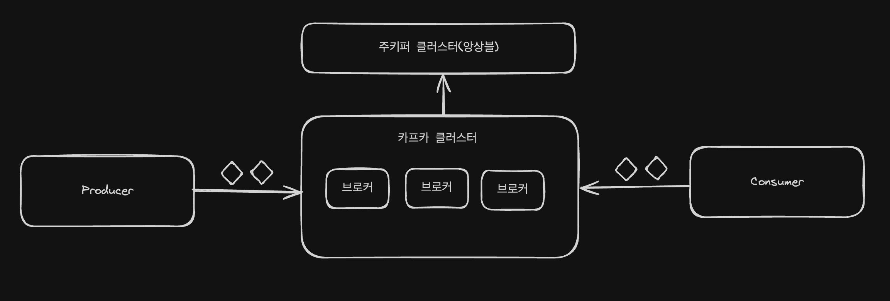
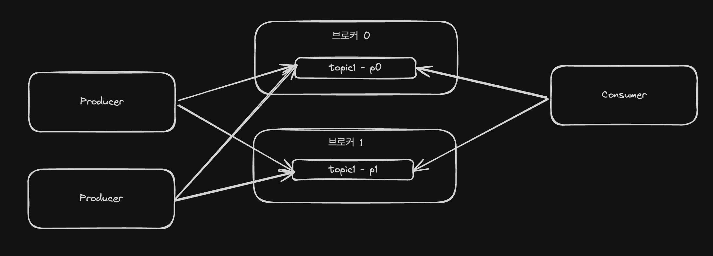
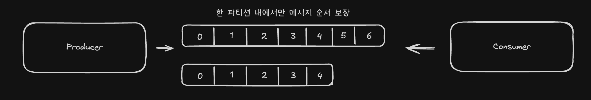
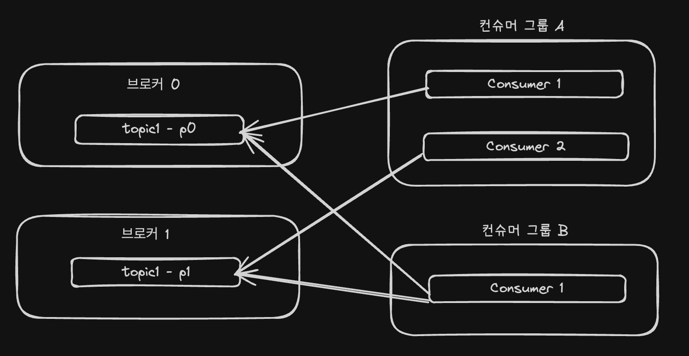

# 1챕터: 카프카 시작하기

## 기본 구조

- Kafka Cluster: 여러 대의 카프카 서버(Brocker)가 협력해서 하나의 시스템처럼 동작하는 것
- Broker: 카프카 서버 그 자체 = 메시지를 저장하고 관리하는 실제 물리적 서버
- Producer: 메시지를 보내는 애플리케이션
- Consumer: 메시지를 받아서 처리하는 애플리케이션
- ZooKeeper: 카프카 클러스터를 관리하고 조정하는 시스템 

## 토픽과 파티션

- 토픽은 메시지를 구분하는 단위: 파일시스템의 폴더와 유사
- 힌 개의 토픽은 한 개 이상의 파티션으로 구성
- 파티션이란, 메시지를 저장하는 물리적인 파일 
- 따라서, 프로듀서는 어떤 토픽에 메시지를 저장해달라고 요청. 컨슈머는 어떤 토픽에 있는 메시지를 읽을거야 라고 요청.

## 파티션과 오프셋, 메시지 순서

- 파티션(파일)은 기본적으로 추가만 가능한 append-only 파일
- 각 메시지 저장 위치를 **offset** 이라고 함
- 프로듀서가 넣은 메시지는 파티션의 맨 뒤에 추가
- 컨슈머는 오프셋 기준으로 메시지를 순서대로 읽음 
- 파티션에 저장된 메시지는 삭제되지않음 (설정에 따라 일정 시간 지난뒤 삭제)

## 토픽은 여러개의 파티션으로 나눌 수 있다면, 프로듀서는 어떻게 어떤 파티션에 저장하는가

- 프로듀서는 라운드로빈 또는 키로 파티션 선택 
- 키를 지정할떈 키의 해시값을 이용해서 저장할 파티션을 선택. -> 즉, 같은 키를 가진 메시지는 같은 파티션에 저장되고 같은 키는 순서를 유지를 보장

## 컨슈머

- 컨슈머는 컨슈머 그룹에 속한다
- 한개의 파티션은 컨슈머그룹의 한개 컨슈머만 연결 가능 
  - 즉 컨슈머 그룹에 속한 컨슈머들은 한 파티션을 공유할 수 없음 
  - 이는 한 컨슈머그룹 기준으로 파티션의 메시지는 순서대로 처리되는것을 보장할 수 있음 
  - 단, 한개의 파티션을 서로 다른 그룹의 컨슈머는 공유할 수 있음 

## 성능

- 카프카 성능 좋음 
- 왜 좋을까?
- 파티션 파일은 OS 페이지캐시를 사용 
  - 파일 I/O가 메모리에서 처리 
  - Zero Copy: 디스크 버퍼에서 네트워크 버퍼로 직접 데이터 복사
  - 브로커가 컨슈머에 대해 딱히 일을 하지않음 (메시지 필터 x, 메시지 재전송 x)
    - 프로듀서와 컨슈머가 직접함
  - 묶어서 보내고, 묶어서 받는게 가능 (batch)
    - 프로듀서: 일정 크기만큼 메시지를 모아서 전송 가능
    - 컨슈머: 최소 크기만큼 메시지를 모아서 조회 가능 
  - 처리량 증대(확장)가 쉬움 
    - 1개장비의 용량 한계 -> 브로커 추가, 파티션 추가
    - 컨슈머가 느림 -> 컨슈머 추가 (+ 파티션 추가)

## 리플리카 

- 파티션의 복제본
  - 복제수만큼 파티션의 복제본이 각 브로커에 생김 
  - 여러개의 파티션중에서 리더와 팔로우를 구성
  - 프로듀서와 컨슈머는 리더를 통해서만 메시지 처리
  - 팔로워는 리더로부터 복제
- 리더가 속한 브로커가 장애나면 다른 팔로워가 리더가 됨
- 고가용성

### 참고자료

- https://www.youtube.com/watch?v=OxMdru93E6k&ab_channel=NAVERD2
- 카프카 핵심 가이드
- https://www.youtube.com/watch?v=0Ssx7jJJADI&ab_channel=%EC%B5%9C%EB%B2%94%EA%B7%A0